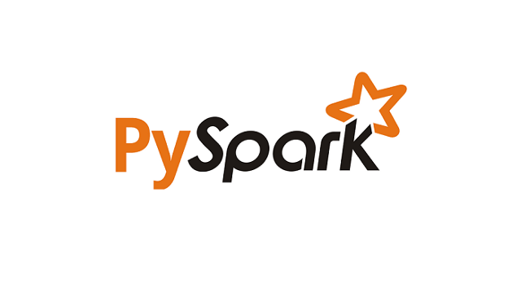

Designed a recommendation system for identifying relevant journals, and articles from IBM Watson studio using collaborative filtering and content based recommender.

Implemented a Flask Web App for sending emergency texts, built an NLP ETL pipeline to transform these
texts into an SQLite database and classified them with Random Forest.

Dveloped a churn predictor for a music platform using ML-PySpark.

 
