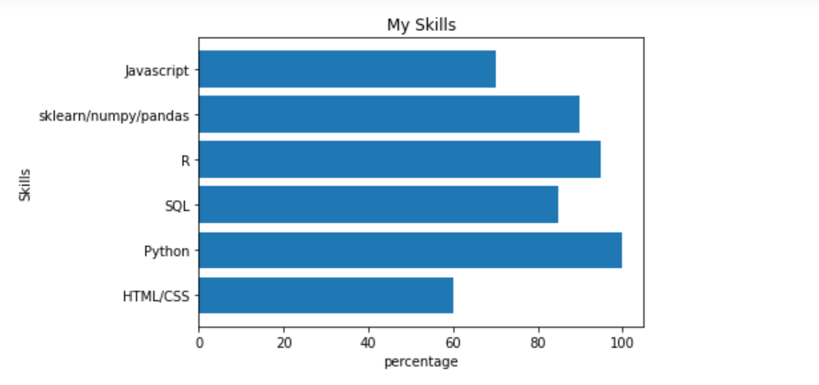

Hello! I am Shalmali, I am particularly nifty in making sense of the data. I am currently pursuing my Master's in Applied Data Science from Indiana University.
I love to combine my passion for data analysis and software development to build great products. Check out this https://github.com/Shal96/Disaster_Response web app I built 
to help emergency workers take quick actions in case of a disaster!
Currently, I am working as a Graduate Research Assistant under the guidance of Proffesor Reda Khairi at the Human-Centered Computing department, wherein we are studying the impact of belief-driven analysis style on participant’s cognition and subsequently capture the difference between the updated prior against the ground truth.
I love to go hiking in my free time, and besides my unhealthy addiction to watching dog videos on Instagram, I love practicing Indian classical dance-form Kathak! Hit me up if you are looking for a data scientist, and let's make your project one of its kind!

> **Age**: 25

> **Residence**: IN, USA

> **Education**: 

> - MS Data Science (2021- Present ), *Indiana University, USA*
> - B.E Electronics and Telecommunication (2014 - 2018 ), *Pune University, India*

> 

